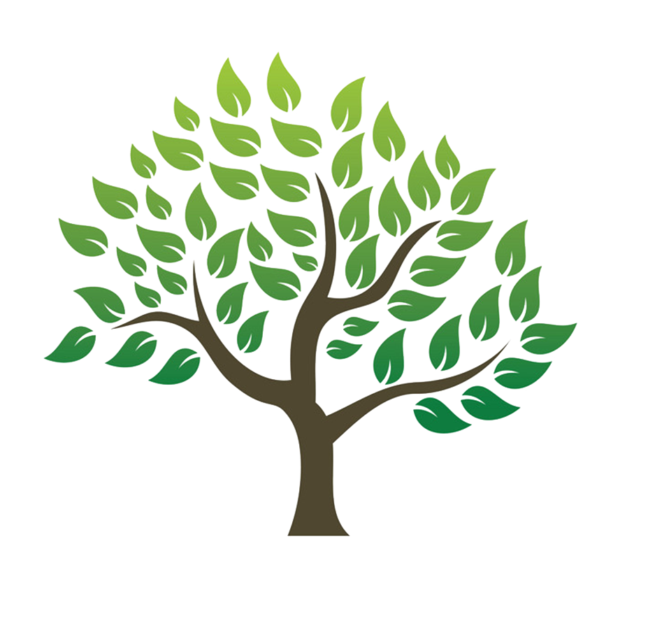

[![Contributors][contributors-shield]][contributors-url]
[![Forks][forks-shield]][forks-url]
[![Stargazers][stars-shield]][stars-url]
[![Issues][issues-shield]][issues-url]
[![MIT License][license-shield]][license-url]

<br />
<p align="center">
  <a href="https://github.com/Benjamin-Casey/COSC320-Group-B">
    
  </a>

  <h3 align="center">College Q</h3>

  <p align="center">
    The aim of this project is to build a web application  that  can  fetch,  analyse  and  display  data  collected  by  devices  measuring  sap flow in trees. The web application will be used by secondary school students in Queensland  to  track  the  water  usage  of  each  measured  tree  in  order  to  undertake  environmental science.
    <br />
    <a href="hhttps://github.com/Benjamin-Casey/COSC320-Group-B"><strong>Explore the docs »</strong></a>
    <br />
    <br />
    <a href="hhttps://github.com/Benjamin-Casey/COSC320-Group-B">View Demo</a>
    ·
    <a href="https://github.com/Benjamin-Casey/COSC320-Group-B/issues">Report Bug</a>
    ·
    <a href="https://github.com/Benjamin-Casey/COSC320-Group-B/issues">Request Feature</a>
  </p>
</p>

<details open="open">
  <summary><h2 style="display: inline-block">Table of Contents</h2></summary>
  <ol>
    <li>
      <a href="#about-the-project">About The Project</a>
      <ul>
        <li><a href="#built-with">Built With</a></li>
      </ul>
    </li>
    <li>
      <a href="#getting-started">Getting Started</a>
      <ul>
        <li><a href="#prerequisites">Prerequisites</a></li>
        <li><a href="#installation">Installation</a></li>
      </ul>
    </li>
    <li><a href="#usage">Usage</a></li>
    <li><a href="#roadmap">Roadmap</a></li>
    <li><a href="#contributing">Contributing</a></li>
    <li><a href="#license">License</a></li>
    <li><a href="#contact">Contact</a></li>
    <li><a href="#acknowledgements">Acknowledgements</a></li>
  </ol>
</details>

## About The Project

### Built With

- [Wordpress](https://wordpress.com/)
- [React](https://reactjs.org/)
- [Senaps](https://products.csiro.au/senaps/)

## Getting Started

To get a local copy up and running follow these simple steps.

### Prerequisites

- npm
  ```sh
  npm install npm@latest -g
  ```

### Installation

1. Clone the repo
   ```sh
   git clone https://github.com/Benjamin-Casey/COSC320-Group-B.git
   ```
2. Run docker container
   ```sh
   docker compose up -d
   ```

## Usage

## Roadmap

See the [open issues](https://github.com/Benjamin-Casey/COSC320-Group-B/issues) for a list of proposed features (and known issues).

## Contributing

Contributions are what make the open source community such an amazing place to be learn, inspire, and create. Any contributions you make are **greatly appreciated**.

1. Fork the Project
2. Create your Feature Branch (`git checkout -b feature/AmazingFeature`)
3. Commit your Changes (`git commit -m 'Add some AmazingFeature'`)
4. Push to the Branch (`git push origin feature/AmazingFeature`)
5. Open a Pull Request

## License

Distributed under the GPL 3.0 License. See `LICENSE` for more information.

## Contact

Adam Austin - aausti23@myune.edu.au
Caleb Bell - cbell25@myune.edu.au
Benjamin Casey - bcasey2@myune.edu.au
Chris Drinkwater - cdrinkwa@myune.edu.au
Joshua le Gresley - jlegresl@myune.edu.au

Project Link: [https://github.com/Benjamin-Casey/COSC320-Group-B](https://github.com/Benjamin-Casey/COSC320-Group-B)

## Acknowledgements

[contributors-shield]: https://img.shields.io/github/contributors/github_username/repo.svg?style=for-the-badge
[contributors-url]: https://github.com/Benjamin-Casey/COSC320-Group-B/graphs/contributors
[forks-shield]: https://img.shields.io/github/forks/github_username/repo.svg?style=for-the-badge
[forks-url]: https://github.com/Benjamin-Casey/COSC320-Group-B/network/members
[stars-shield]: https://img.shields.io/github/stars/github_username/repo.svg?style=for-the-badge
[stars-url]: https://github.com/Benjamin-Casey/COSC320-Group-B/stargazers
[issues-shield]: https://img.shields.io/github/issues/github_username/repo.svg?style=for-the-badge
[issues-url]: https://github.com/Benjamin-Casey/COSC320-Group-B/issues
[license-shield]: https://img.shields.io/github/license/github_username/repo.svg?style=for-the-badge
[license-url]: https://github.com/Benjamin-Casey/COSC320-Group-B/blob/master/LICENSE
